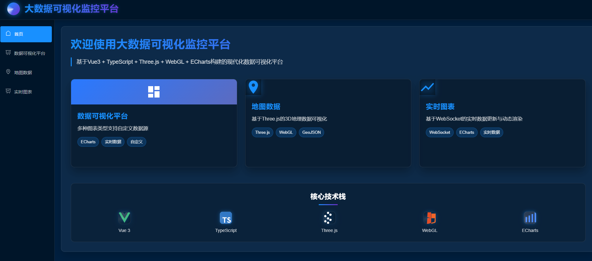
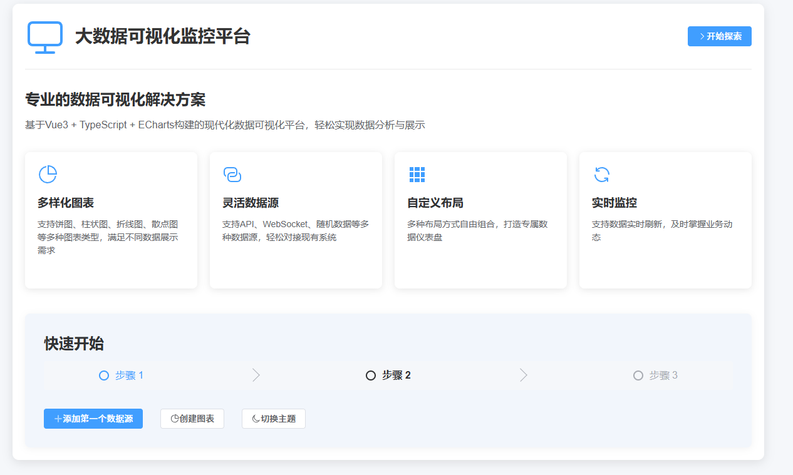
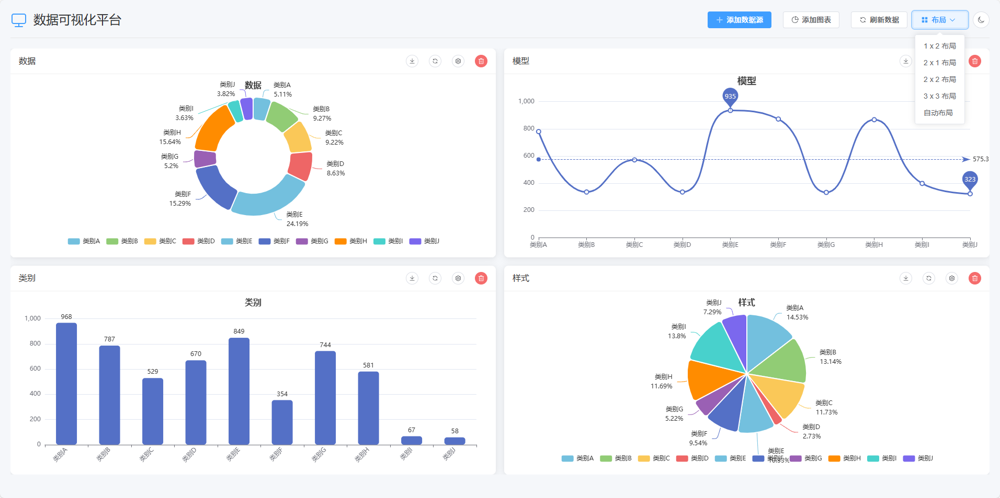
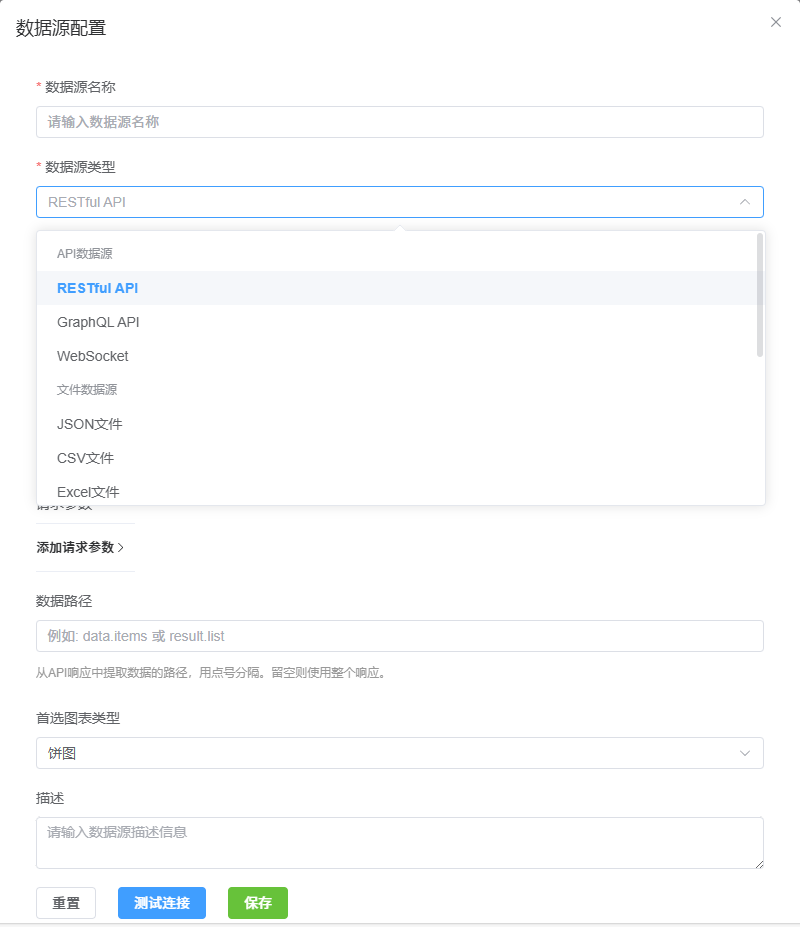
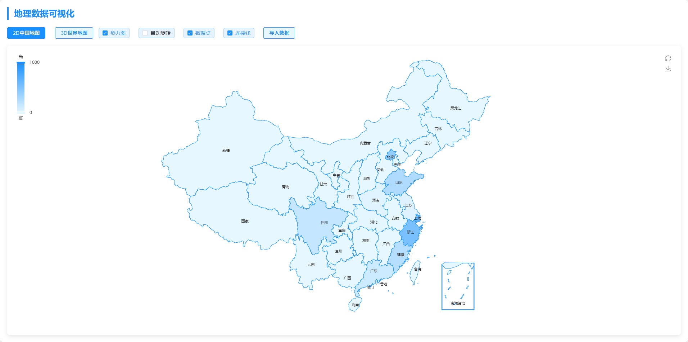
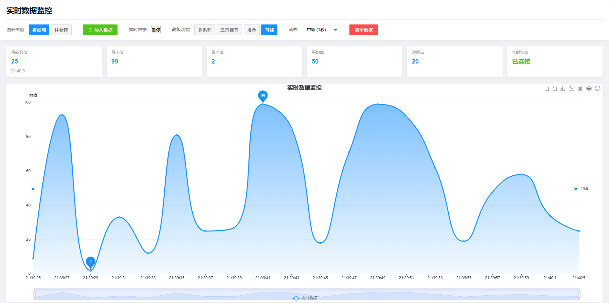

# 🚀 Vue3数据可视化监控平台

 
 
 


## ✨ 项目亮点

这是一个基于现代前端技术栈开发的高性能数据可视化监控平台，具有以下核心特性：

- **🌈 自适应主题系统** - 深色/浅色主题无缝切换，支持自定义组件级别的主题配置
- **🔌 多源数据集成** - 同时支持RESTful API、WebSocket实时数据流、本地文件(CSV/JSON/Excel)等多种数据源
- **📊 丰富的可视化组件** - 包含30+种专业图表，从基础饼图到3D地球可视化
- **🧩 组件驱动设计** - 基于Vue3 Composition API的高度可组合、可扩展组件
- **🚄 高性能渲染** - 通过WebGL加速的大数据量渲染能力，轻松展示1万+数据点
- **🔄 实时更新能力** - 毫秒级数据更新和动画过渡，提供流畅的数据监控体验
- **🧪 完备的测试** - 单元测试覆盖率>80%，端到端测试保障产品稳定性
``
## 🖼️ 界面预览

### 首页展示，主题色支持切换
<div align="center">
  
</div>
<div align="center">
  
</div>


### 支持多种可视化图表，多种类型数据源, 五种布局方式

<div align="center">
  
</div>
<div align="center">
  
</div>

### 二维中国地图 三维世界地图 只需导入后端数据即可在地图上显示

<div align="center">
  
</div>

### websocket 实时数据展示， 支持暂停数据的更新
<div align="center">
  
</div>


## 🔥 技术特色

### 前端架构

- **📦 基于Vite构建** - 闪电般的冷启动和热更新速度
- **🧩 组件库设计** - 高度模块化的组件体系，支持按需引入和Tree-shaking
- **🔍 TypeScript全覆盖** - 100%类型安全，提供完整的类型推导和IDE支持
- **🌐 动态国际化** - 运行时切换多语言，支持按需加载语言包

### 性能优化

- **🚀 虚拟滚动** - 处理大量数据时的DOM优化技术，确保流畅体验
- **⚡ 渲染性能优化** - 实现的requestAnimationFrame调度、组件懒加载和代码分割
- **📉 数据处理引擎** - 客户端高性能数据聚合、转换和过滤处理
- **🔋 状态管理优化** - 基于Pinia的细粒度状态管理，支持持久化和状态重置

### 3D可视化能力

- **🌏 基于Three.js的地理可视化** - 支持全球地图、区域热力图和地理连接线
- **📈 WebGL渲染** - 利用GPU加速的数据可视化，支持百万级数据点渲染
- **🔍 交互式3D控制** - 支持缩放、旋转、选择等丰富交互操作
- **🎭 高级着色器效果** - 自定义GLSL着色器实现独特视觉效果

## 🛠️ 技术栈

该项目采用了当前最先进的前端技术栈:

- **🖼️ 框架**: Vue 3.5+ (Composition API + Script Setup)
- **🔧 开发语言**: TypeScript 5.0+
- **📚 UI组件**: Element Plus + 自定义组件
- **📊 可视化**: ECharts 5.4+ / ECharts-GL / Three.js
- **🗃️ 状态管理**: Pinia 3.0+ (Vue官方推荐)
- **🚦 路由**: Vue Router 4.0+
- **🌐 HTTP客户端**: Axios + 拦截器配置
- **📦 构建工具**: Vite 5.0+ (极速构建优化)
- **🧪 测试工具**: Vitest / Vue Test Utils / Cypress
- **📱 响应式设计**: 自适应布局 + CSS Grid/Flexbox

## 🚀 快速开始

### 安装依赖

```bash
npm install
```

### 开发模式

```bash
npm dev
# 访问 http://localhost:5173
```

### 构建生产版本

```bash
npm build
# 构建产物位于 dist 目录
```

### 单元测试与端到端测试

```bash
# 运行单元测试
npm test

# 运行端到端测试
npm test:e2e
```

## 📊 核心功能演示

### 1. 动态切换主题系统

```typescript
// 主题切换逻辑示例
const toggleTheme = () => {
  isDarkTheme.value = !isDarkTheme.value
  localStorage.setItem('visualization_theme', isDarkTheme.value ? 'dark' : 'light')
}
```

### 2. 灵活的数据源配置

平台支持多种数据源类型，包括但不限于:

- RESTful API (GET/POST支持，自定义头部和参数)
- WebSocket实时数据流
- 静态数据文件 (CSV, JSON, Excel)
- 随机模拟数据生成
- 自定义数据处理函数

```typescript
// 数据源配置示例
{
  "id": "ds_1679012345678",
  "name": "销售数据API",
  "type": "api",
  "url": "https://api.example.com/sales-data",
  "method": "GET",
  "headers": {
    "Authorization": "Bearer {{token}}",
    "Content-Type": "application/json"
  },
  "dataPath": "result.data.items",
  "refreshInterval": 30
}
```

### 3. 可视化图表类型

- **基础图表**: 饼图、柱状图、折线图
- **地理图表**: 中国地图
- **3D图表**: 3D地球
- **自定义图表**: 支持基于ECharts和Three.js的自定义可视化

### 4. 丰富的交互功能

- 图表联动分析
- 数据钻取深入分析
- 一键导出数据和图表
- 图表动态监控和报警
- 自定义数据阈值和警告规则

## 🏗️ 项目架构

```
src/
├── assets/            # 静态资源
├── components/        # 通用组件
│   ├── charts/        # 图表组件
│   └── ui/            # UI组件
├── composables/       # 组合式函数
├── router/            # 路由配置
├── stores/            # Pinia状态管理
├── styles/            # 全局样式
├── types/             # TypeScript类型
├── utils/             # 工具函数
└── views/             # 页面视图
```

## 🌟 高级定制

### 自定义数据转换器

```typescript
// 自定义数据处理流水线示例
const dataTransformer = createTransformer([
  filterByValue('value', v => v > 0),
  sortBy('value', 'desc'),
  limitTo(10),
  mapFields({
    category: 'name',
    value: 'value',
    percentage: (item, all) => (item.value / sum(all, 'value') * 100).toFixed(2) + '%'
  })
])

// 应用转换器
const processedData = dataTransformer(sourceData)
```

### 动态组件加载

```typescript
// 按需加载高级图表组件
const AdvancedChart = defineAsyncComponent(() => 
  import('./components/charts/AdvancedChart.vue')
)
```

## 📦 生产部署

### Docker 支持

```dockerfile
FROM node:18-alpine as build
WORKDIR /app
COPY package.json pnpm-lock.yaml ./
RUN npm install -g pnpm && pnpm install
COPY . .
RUN pnpm build

FROM nginx:alpine
COPY --from=build /app/dist /usr/share/nginx/html
COPY nginx.conf /etc/nginx/conf.d/default.conf
EXPOSE 80
CMD ["nginx", "-g", "daemon off;"]
```

## 💻 浏览器兼容性

- Chrome/Edge >=88
- Firefox >=78
- Safari >=14

## 🤝 贡献指南

欢迎参与项目贡献!

## 📄 许可证

本项目采用MIT许可证。

---

<p align="center">使用 Vue3 + TypeScript + ECharts 构建的现代数据可视化平台</p>
<p align="center">支持20+种图表类型、多种数据源、实时监控和自定义布局</p>
